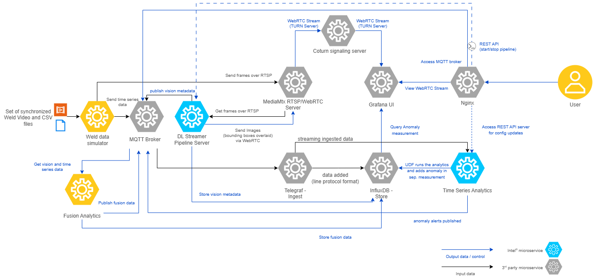

# Weld Defect Detection

<!--hide_directive

  <a class="icon_github" href="https://github.com/open-edge-platform/edge-ai-suites/blob/main/manufacturing-ai-suite/industrial-edge-insights-multimodal">
     GitHub project
  </a>
  <a class="icon_document" href="https://github.com/open-edge-platform/edge-ai-suites/blob/main/manufacturing-ai-suite/industrial-edge-insights-multimodal/README.md">
     Readme
  </a>

hide_directive-->

MultiModal Weld Defect Detection sample application demonstrates how to use AI
at the edge to identify defects in manufacturing environments by analyzing both
image and time series sensor data.

## How It Works

### Data flow explanation

As seen in the architecture diagram above, the sample app at a high-level comprises of a data simulator, analytics and visualization components.
Below is an explanation of how this architecture translates to data flow in the weld defect
detection use case.

#### 1. **Weld Data Simulator**

The Weld Data Simulator uses sets of time synchronized .avi and .csv files from the `edge-ai-suites/manufacturing-ai-suite/industrial-edge-insights-multimodal/weld-data-simulator/simulation-data/` subset of test dataset coming from [Intel_Robotic_Welding_Multimodal_Dataset](https://huggingface.co/datasets/amr-lopezjos/Intel_Robotic_Welding_Multimodal_Dataset).
It ingests the .avi files as RTSP streams via the **mediamtx** server. This enables real-time video ingestion, simulating camera feeds for weld defect detection.
Similarly, it ingests the .csv files as data points into **Telegraf** using the **MQTT** protocol.

---

#### 2. **Analytics Modules**

##### 2.1 **DL Streamer Pipeline Server**

The `DL Streamer Pipeline Server` microservice reads the frames/images from the MediaMTX server over RTSP protocol, runs the configured DL weld
defect classification model, publishes the frame metadata results over MQTT and generates the WebRTC stream with bounded boxes for visualization in **Grafana**.

###### **`DL Streamer Pipeline Server config.json`**

**Pipeline Configuration**:

| Key            | Description                                                                 | Example Value                          |
|----------------|-----------------------------------------------------------------------------|----------------------------------------|
| `name`         | The name of the pipeline configuration.                                     | `"weld_defect_classification"`        |
| `source`       | The source type for video ingestion.                                        | `"gstreamer"`                         |
| `queue_maxsize`| Maximum size of the queue for processing frames.                            | `50`                                  |
| `pipeline`     | GStreamer pipeline string defining the video processing flow from RTSP source through classification to output. | `"rtspsrc location=\"rtsp://mediamtx:8554/live.stream\" latency=100 name=source ! rtph264depay ! h264parse ! decodebin ! videoconvert ! gvaclassify inference-region=full-frame name=classification ! gvametaconvert add-empty-results=true name=metaconvert ! queue ! gvafpscounter ! appsink name=destination"` |
| `parameters`   | Configuration parameters for pipeline elements, specifically for the classification element properties. | See below for nested structure |

**Parameters Properties**:

| Key                          | Description                                                                 | Value                          |
|------------------------------|-----------------------------------------------------------------------------|--------------------------------|
| `classification-properties`  | Properties for the classification element in the pipeline.                  | Object containing element configuration |
| `element.name`               | Name of the GStreamer element to configure.                                 | `"classification"`            |
| `element.format`             | Format type for element properties.                                         | `"element-properties"`        |

**Destination Configuration**:

| Key                | Description                                                                 | Example Value                          |
|--------------------|-----------------------------------------------------------------------------|----------------------------------------|
| `destination`      | Configuration for output destinations of the pipeline.                      | Object containing metadata and frame settings |
| `metadata.type`    | The protocol type for sending metadata information.                         | `"mqtt"`                              |
| `metadata.topic`   | The MQTT topic where vision classification results are published.           | `"vision_weld_defect_classification"` |
| `frame.type`       | The protocol type for streaming video frames.                               | `"webrtc"`                            |
| `frame.peer-id`    | Unique identifier for the WebRTC peer connection.                           | `"samplestream"`                      |

---

##### 2.2 **Time Series Analytics Microservice**

**Time Series Analytics Microservice** uses **Kapacitor** - a real-time data processing engine that enables users to analyze time series data. It reads the weld sensor data points point by point coming from **Telegraf**, runs the ML CatBoost model to identify the anomalies, writes the results into configured measurement/table in **InfluxDB** and publishes anomalous data over MQTT. Also, publishes all the processed weld sensor data points over MQTT.

The UDF deployment package used for
weld data is available
at `edge-ai-suites/manufacturing-ai-suite/industrial-edge-insights-multimodal/config/time-series-analytics-microservice`. Directory details is as below:

###### **`config.json`**

**UDFs Configuration**:

The `udfs` section specifies the details of the UDFs used in the task.

| Key     | Description                                                                 | Example Value                          |
|---------|-----------------------------------------------------------------------------|----------------------------------------|
| `name`  | The name of the UDF script.                                                 | `"weld_anomaly_detector"`       |
| `models`| The name of the model file used by the UDF.                                 | `"weld_anomaly_detector.cb"`   |

> **Note:** The maximum allowed size for `config.json` is 5 KB.

---

**Alerts Configuration**:

The `alerts` section defines the settings for alerting mechanisms, such as MQTT protocol.

**MQTT Configuration**:

The `mqtt` section specifies the MQTT broker details for sending alerts.

| Key                 | Description                                                                 | Example Value          |
|---------------------|-----------------------------------------------------------------------------|------------------------|
| `mqtt_broker_host`  | The hostname or IP address of the MQTT broker.                              | `"ia-mqtt-broker"`     |
| `mqtt_broker_port`  | The port number of the MQTT broker.                                         | `1883`                |
| `name`              | The name of the MQTT broker configuration.                                 | `"my_mqtt_broker"`     |

###### **`udfs/`**

Contains the python script to process the incoming data.
Uses CatBoostClassifier machine learning algorithm from the CatBoost library to run on CPU to
detect anomalous weld data points using sensor data.

**Note**: Please note, CatBoost models don't run on Intel GPUs.

###### **`tick_scripts/`**

The TICKScript `weld_anomaly_detector.tick` determines processing of the input data coming in.
Mainly, has the details on execution of the UDF file, storage of processed data and publishing of alerts.
By default, it is configured to publish the alerts to **MQTT**.

###### **`models/`**

The `weld_anomaly_detector.cb` is a model built using the CatBoostClassifier Algo of CatBoost ML
library.

---

##### 2.3 **Fusion Analytics**

**Fusion Analytics** subscribes to the MQTT topics coming out of `DL Streamer Pipeline Server` and `Time Series Analytics Microservice`, applies `AND`/`OR` logic to determine the anomalies during weld process, publishes the results over MQTT and writes the results as a measurement/table in **InfluxDB**

#### 3. **Data Storage**

**InfluxDB** stores the incoming data coming from **Telegraf**, **Time Series Analytics Microservice** and **Fusion Analytics** .

#### 4. **Data Visualization**

**Grafana** provides an intuitive user interface for visualizing time series data stored in **InfluxDB** and also rendering the output of `DL Streamer Pipeline Server` coming as WebRTC stream. Additionally, it visualizes the fusion analytics results stored in **InfluxDB**.

---

## Next Steps

Refer to the detailed instructions in [Get Started](../get-started.md).

<!--hide_directive
:::{toctree}
:hidden:

:::
hide_directive-->
